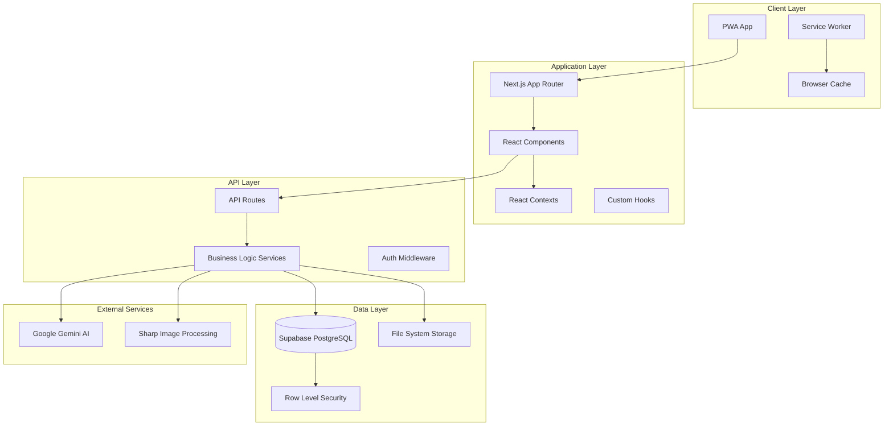
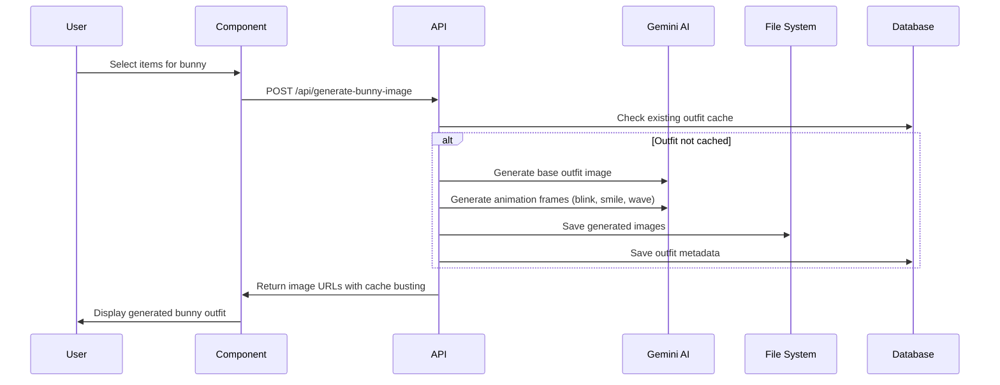
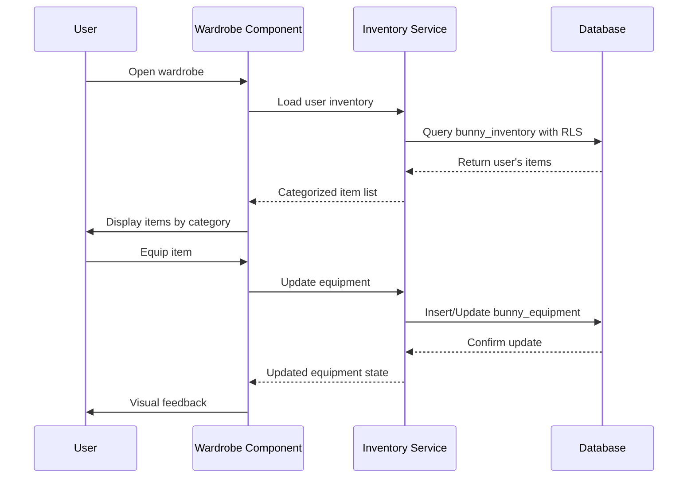
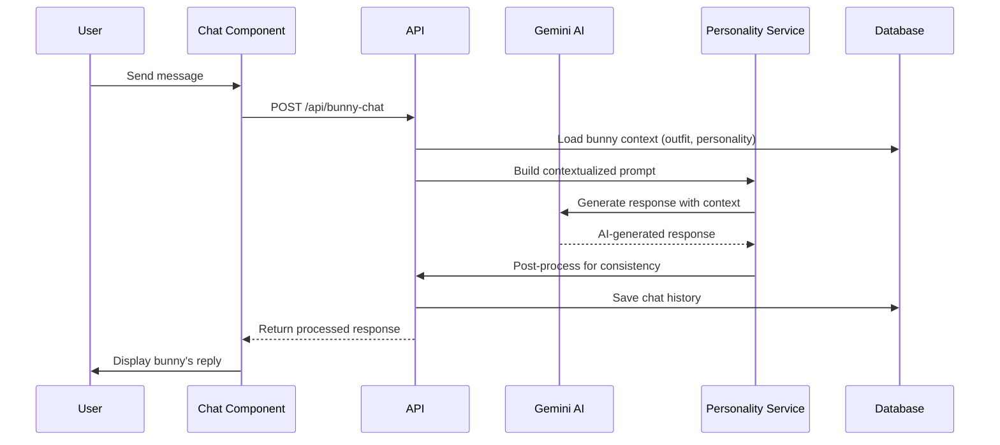
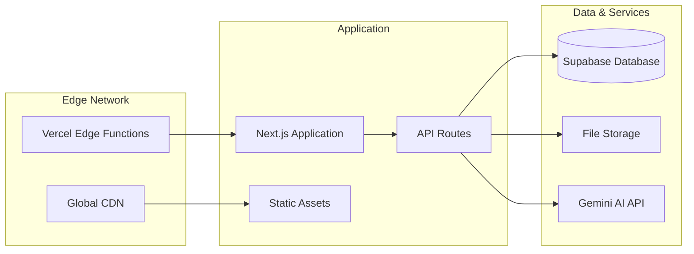

# Architecture Overview

This document provides a comprehensive overview of the Bunny Tamagotchi system architecture, component relationships, data flow, and design decisions.

## 🏗️ High-Level Architecture



## 🔧 Technology Stack

### Frontend
- **Next.js 15** - Full-stack React framework with App Router
- **React 18** - Component-based UI library with concurrent features
- **TypeScript** - Type-safe development
- **Tailwind CSS** - Utility-first CSS framework
- **PWA** - Progressive Web App capabilities

### Backend
- **Next.js API Routes** - Serverless API endpoints
- **Supabase** - Backend-as-a-Service with PostgreSQL
- **Row Level Security** - Database-level security policies

### AI & Image Processing
- **Google Gemini AI** - Advanced AI image generation
- **Sharp** - High-performance image processing
- **Canvas API** - Browser-based image manipulation

### Infrastructure
- **Vercel** - Deployment and hosting platform
- **File System Storage** - Generated image storage
- **Browser Caching** - Client-side performance optimization

---

## 📊 System Components

### 1. Frontend Architecture

#### Component Hierarchy
```
App Layout
├── BunnyProvider (Global State)
├── AuthProvider (Authentication)
├── NotificationProvider (Notifications)
└── Main Application
    ├── Bunny Display
    │   ├── Animated Bunny
    │   ├── Expression System
    │   └── Scene Background
    ├── Wardrobe System
    │   ├── Item Categories
    │   ├── Inventory Management
    │   └── Outfit Preview
    ├── Chat Interface
    │   ├── Message History
    │   ├── Input System
    │   └── Personality Display
    └── Admin Panel
        ├── Debug Tools
        ├── Scene Management
        └── System Controls
```

#### State Management
- **React Context**: Global state management for bunny, auth, and notifications
- **Local State**: Component-specific state using useState and useReducer
- **Server State**: API data managed through custom hooks with caching
- **Persistence**: Critical state persisted to localStorage and database

#### PWA Features
- **Service Worker**: Offline functionality and caching strategies
- **App Manifest**: Installation and platform integration
- **Responsive Design**: Mobile-first approach with touch optimization
- **Performance**: Code splitting and lazy loading

### 2. API Architecture

#### Route Structure
```
/api/
├── generate-bunny-image      # Core outfit generation
├── generated-outfits         # Outfit listing and management
├── save-outfit              # Outfit persistence
├── force-regenerate-outfit  # Outfit regeneration with new prompts
├── bunny-chat              # AI conversation system
├── debug-populate-inventory # Development inventory tools
├── clear-data              # Development data management
├── scenes/                 # Scene management
├── items/                  # Item generation and upload
└── admin/                  # Administrative functions
```

#### Middleware & Security
- **Authentication**: Supabase auth integration with JWT tokens
- **Authorization**: Row Level Security policies for data isolation
- **Validation**: Comprehensive input validation using TypeScript
- **Error Handling**: Consistent error response format across all endpoints

### 3. Data Architecture

#### Database Schema (Supabase PostgreSQL)
```sql
-- Core Tables
bunnies (id, user_id, name, personality_traits, created_at, updated_at)
items (id, name, slot, rarity, cost, image_url, description)
bunny_inventory (bunny_id, item_id, quantity, acquired_at)
bunny_equipment (bunny_id, item_id, slot, equipped_at)
outfits (id, bunny_id, name, outfit_key, equipped_items, created_at)

-- Scene System
scenes (id, name, description, image_url, created_at)
bunny_scenes (bunny_id, scene_id, is_active)

-- Chat History
chat_messages (id, bunny_id, user_message, bunny_response, created_at)
```

#### Row Level Security Policies
```sql
-- Users can only access their own bunny data
CREATE POLICY bunny_isolation ON bunnies
    FOR ALL USING (auth.uid() = user_id);

-- Inventory isolation by bunny ownership
CREATE POLICY inventory_isolation ON bunny_inventory
    FOR ALL USING (
        bunny_id IN (
            SELECT id FROM bunnies WHERE user_id = auth.uid()
        )
    );
```

#### File System Organization
```
public/
├── generated-bunnies/           # AI-generated outfit images
│   └── {outfit-key}/
│       ├── normal.png           # Base outfit image
│       ├── blink.png            # Blink animation frame
│       ├── smile.png            # Smile animation frame
│       ├── wave.png             # Wave animation frame
│       ├── scene_normal.png     # Scene composition
│       ├── scene_blink.png      # Scene with blink
│       └── metadata.json        # Generation metadata
├── base-bunnies/                # Base bunny templates
│   ├── original/               # Original base images
│   └── processed/              # Transparent processed versions
├── items/                      # Item reference images
└── scenes/                     # Scene background images
```

---

## 🔄 Data Flow Patterns

### 1. Outfit Generation Pipeline



### 2. Inventory Management Flow



### 3. AI Chat System Flow



---

## 🎯 Design Patterns & Principles

### 1. Component Patterns

#### Compound Components
```typescript
// Wardrobe compound component pattern
<Wardrobe>
  <Wardrobe.Categories />
  <Wardrobe.ItemGrid />
  <Wardrobe.OutfitPreview />
</Wardrobe>
```

#### Render Props
```typescript
// Flexible bunny rendering
<BunnyRenderer>
  {({ bunnyUrl, isLoading, expressions }) => (
    <AnimatedBunny 
      src={bunnyUrl} 
      loading={isLoading}
      expressions={expressions}
    />
  )}
</BunnyRenderer>
```

#### Custom Hooks
```typescript
// Reusable outfit generation logic
const useOutfitGeneration = (bunnyId: string) => {
  const [generating, setGenerating] = useState(false);
  const [outfitUrl, setOutfitUrl] = useState<string | null>(null);
  
  const generateOutfit = useCallback(async (items: Item[]) => {
    // Generation logic
  }, [bunnyId]);
  
  return { generating, outfitUrl, generateOutfit };
};
```

### 2. Service Layer Architecture

#### Modular Services
```typescript
// Clear separation of concerns
export class InventoryService {
  static async getItems(): Promise<Item[]> { /* ... */ }
  static async addItemToInventory(): Promise<boolean> { /* ... */ }
}

export class GeminiImageService {
  async generateOutfit(): Promise<string> { /* ... */ }
  async generateAnimationFrames(): Promise<string[]> { /* ... */ }
}

export class BunnyPersonalityService {
  static generateResponse(): string { /* ... */ }
  static updateTraits(): void { /* ... */ }
}
```

#### Error Handling Strategy
```typescript
// Consistent error handling across services
class ServiceError extends Error {
  constructor(
    message: string,
    public code: string,
    public statusCode: number = 500
  ) {
    super(message);
  }
}

// Usage in API routes
try {
  const result = await service.performOperation();
  return NextResponse.json(result);
} catch (error) {
  if (error instanceof ServiceError) {
    return NextResponse.json(
      { error: error.message, code: error.code },
      { status: error.statusCode }
    );
  }
  return NextResponse.json(
    { error: 'Internal server error' },
    { status: 500 }
  );
}
```

### 3. Performance Patterns

#### Image Optimization
- **Cache Busting**: Timestamp-based URL versioning
- **Lazy Loading**: Progressive image loading for large galleries
- **Format Optimization**: WebP with fallbacks
- **Size Optimization**: Multiple resolution variants

#### Database Optimization
- **Query Optimization**: Efficient joins and indexing
- **Bulk Operations**: Upsert operations for inventory management
- **Connection Pooling**: Supabase connection management
- **Row Level Security**: Database-level access control

---

## 🔒 Security Architecture

### 1. Authentication & Authorization

#### Multi-Layer Security
```
┌─────────────────────────────────────┐
│           Client Layer              │
│  - JWT Token Storage               │
│  - Session Management             │
└─────────────────────────────────────┘
                 │
┌─────────────────────────────────────┐
│          Application Layer          │
│  - Route Protection               │
│  - Input Validation               │
│  - CSRF Protection                │
└─────────────────────────────────────┘
                 │
┌─────────────────────────────────────┐
│           Database Layer            │
│  - Row Level Security (RLS)       │
│  - Column-Level Permissions       │
│  - Audit Logging                  │
└─────────────────────────────────────┘
```

#### RLS Policy Examples
```sql
-- Bunny ownership isolation
CREATE POLICY bunny_owner_access ON bunnies
    FOR ALL USING (auth.uid() = user_id);

-- Inventory access through bunny ownership
CREATE POLICY inventory_access ON bunny_inventory
    FOR ALL USING (
        EXISTS (
            SELECT 1 FROM bunnies 
            WHERE id = bunny_inventory.bunny_id 
            AND user_id = auth.uid()
        )
    );
```

### 2. Data Validation

#### Input Sanitization
```typescript
// API route validation
const generateBunnyImageSchema = z.object({
  bunnyId: z.string().uuid(),
  equippedItems: z.array(z.object({
    item_id: z.string(),
    slot: z.enum(['head', 'face', 'upper_body', 'lower_body', 'feet', 'accessory']),
    name: z.string().max(100),
    image_url: z.string().url().optional()
  })),
  generateAnimation: z.boolean().default(true),
  forceRegenerate: z.boolean().default(false)
});
```

#### XSS Prevention
- **Content Security Policy**: Strict CSP headers
- **Input Escaping**: Automatic HTML entity encoding
- **Sanitization**: DOMPurify for user content
- **Type Safety**: TypeScript for compile-time safety

---

## 📊 Performance Considerations

### 1. Caching Strategy

#### Multi-Level Caching
```
Browser Cache (1 hour)
    ↓
CDN Cache (24 hours)
    ↓
Application Cache (in-memory)
    ↓
Database Query Cache
    ↓
File System
```

#### Cache Invalidation
- **Time-based**: Automatic expiration for frequently changing data
- **Event-based**: Manual invalidation on data updates
- **Version-based**: URL versioning for static assets
- **Selective**: Granular cache clearing for specific resources

### 2. Image Processing Optimization

#### Transparent Base System
```typescript
// Optimized base processing
class TransparentBaseProcessor {
  // 4% performance improvement over original bases
  static async processBaseImage(inputPath: string): Promise<Buffer> {
    return sharp(inputPath)
      .png({ quality: 95 })
      .removeAlpha()  // Remove transparency
      .flatten({ background: { r: 255, g: 255, b: 255 } })  // White background
      .toBuffer();
  }
}
```

#### Batch Processing
- **Parallel Generation**: Multiple animation frames generated simultaneously
- **Resource Pooling**: Reuse Sharp instances
- **Memory Management**: Buffer cleanup and garbage collection
- **Error Recovery**: Graceful handling of generation failures

---

## 🚀 Deployment Architecture

### Production Deployment (Vercel)



### Environment Configuration

#### Development
- **Local Database**: Supabase local development
- **File Storage**: Local file system
- **Hot Reloading**: Next.js development server
- **Debug Tools**: Comprehensive logging and admin panels

#### Production
- **Serverless Functions**: Vercel edge functions
- **Database**: Supabase hosted PostgreSQL
- **CDN**: Global content distribution
- **Monitoring**: Real-time performance metrics

---

## 🔧 Development Workflow

### Code Organization
```
/app
├── /components     # Reusable React components
├── /context       # React context providers
├── /lib           # Business logic and services
├── /api           # Next.js API routes
└── /hooks         # Custom React hooks

/docs              # Comprehensive documentation
/public            # Static assets and generated content
/scripts           # Build and deployment scripts
```

### Quality Assurance
- **TypeScript**: Compile-time type safety
- **ESLint**: Code quality and consistency
- **Prettier**: Automated code formatting
- **Testing**: Unit and integration tests (future enhancement)

---

*Last updated: September 2025*