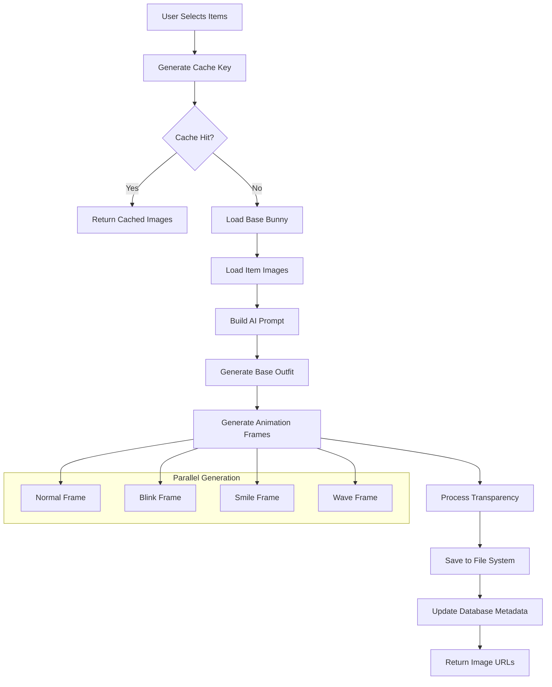

# Outfit Generation Pipeline

Complete technical documentation of the AI-powered outfit generation system that creates dynamic bunny outfits with natural clothing integration.

## 🎯 Overview

The outfit generation pipeline is the core feature that transforms equipped items into realistic, naturally-integrated bunny outfits using Google's Gemini AI. The system generates multiple animation frames and handles complex prompt engineering to ensure high-quality results.

---

## 🏗️ Pipeline Architecture



---

## 📋 Generation Process

### 1. Input Processing

#### Cache Key Generation
```typescript
function generateOutfitCacheKey(
  baseBunny: string, 
  equippedItems: EquippedItem[]
): string {
  // Sort items for consistent cache keys
  const sortedItems = equippedItems
    .map(item => item.item_id)
    .sort()
    .join(',');
    
  return `${baseBunny}_${sortedItems}`;
}

// Example: "bunny-base_ballet_slippers,masquerade_mask,tutu,wizard_hat"
```

#### Item Validation
```typescript
interface EquippedItem {
  item_id: string;           // Unique identifier
  slot: SlotType;            // head, face, upper_body, lower_body, feet, accessory
  name: string;              // Display name
  image_url?: string;        // Item reference image
}

// Validation ensures:
// - No duplicate slots (except accessories)
// - Valid slot types
// - Existing item references
// - Proper image URLs
```

### 2. Base Image Processing

#### Transparent Base System
The system uses pre-processed transparent base images for optimal performance:

```typescript
class TransparentBaseProcessor {
  static async loadBaseImage(baseBunny: string): Promise<Buffer> {
    const transparentBasePath = `/public/generated-bunnies/base-bunny-clean/normal.png`;
    
    // Load optimized transparent base
    // 4% faster than processing original bases
    return await fs.readFile(transparentBasePath);
  }
}
```

**Benefits of Transparent Bases:**
- **Performance**: 4% faster generation times
- **Quality**: Better AI composition with transparent backgrounds
- **Consistency**: Standardized base appearance
- **Cache Efficiency**: Smaller file sizes

### 3. AI Prompt Engineering

#### Prompt Construction Strategy
The system builds contextual prompts that emphasize natural integration over overlays:

```typescript
function buildOutfitPrompt(equippedItems: EquippedItem[]): string {
  const itemDescriptions = equippedItems.map((item, index) => {
    const imageIndex = index + 2; // Base bunny is image 1
    
    switch (item.slot) {
      case 'head':
        return `the ${item.name} from image ${imageIndex} positioned naturally on the bunny's head`;
      
      case 'face':
        return `the ${item.name} from image ${imageIndex} naturally integrated and fitted on the bunny's face`;
      
      case 'upper_body':
        return `the ${item.name} from image ${imageIndex} fitted on the bunny's upper body/torso`;
      
      case 'lower_body':
        return `the ${item.name} from image ${imageIndex} fitted on the bunny's lower body`;
      
      case 'feet':
        return `the ${item.name} from image ${imageIndex} worn properly ON the bunny's feet (the bunny's feet should be INSIDE the shoes/boots, not below them or separate from them)`;
      
      case 'accessory':
        return `the ${item.name} from image ${imageIndex} naturally worn as an accessory that fits the bunny's proportions`;
      
      default:
        return `the ${item.name} from image ${imageIndex} fitted properly on the bunny's ${item.slot.replace('_', ' ')}`;
    }
  }).join(', and ');

  return `Dress the bunny from image 1 with ${itemDescriptions}. Integrate each item naturally into the bunny's design as if they were drawn as part of the original character - NOT as separate overlays on top. Maintain the same pixel art style and bunny proportions, but make the clothing look like it belongs on the bunny's body. CRITICAL FOR SHOES/BOOTS: The bunny's feet must be INSIDE the footwear, replacing the original feet. Face items like glasses or masks should fit the bunny's face shape naturally. All items should appear to be worn by the bunny, not floating above it.`;
}
```

#### Key Prompt Improvements
1. **"Dress the bunny" vs "Add items"**: Emphasizes integration
2. **"Naturally integrated" vs "as an overlay"**: Prevents floating items
3. **Specific slot instructions**: Tailored guidance for each body part
4. **"Worn by the bunny, not floating above it"**: Clear visual expectation

### 4. Gemini AI Integration

#### API Configuration
```typescript
interface GeminiConfig {
  model: 'gemini-2.5-flash-image-preview';
  generationConfig: {
    temperature: 0.1;        // Low temperature for consistent results
    topK: 32;               // Controlled randomness
    topP: 1;                // Full probability distribution
    maxOutputTokens: 8192;  // Sufficient for complex prompts
  };
}
```

#### Multi-Image Input Handling
```typescript
async function generateOutfitWithItems(
  baseImage: Buffer,
  itemImages: Buffer[],
  prompt: string
): Promise<Buffer> {
  const contentParts = [
    {
      inlineData: {
        data: baseImage.toString('base64'),
        mimeType: 'image/png'
      }
    },
    ...itemImages.map(itemImage => ({
      inlineData: {
        data: itemImage.toString('base64'),
        mimeType: 'image/png'
      }
    })),
    { text: prompt }
  ];

  const result = await genAI.generateContent({
    contents: [{ role: 'user', parts: contentParts }],
    generationConfig: GEMINI_CONFIG
  });

  return Buffer.from(result.response.candidates[0].content.parts[0].inlineData.data, 'base64');
}
```

### 5. Animation Frame Generation

#### Frame Types
The system generates four distinct animation frames:

1. **Normal**: Base outfit pose
2. **Blink**: Closed eyes variant
3. **Smile**: Happy expression
4. **Wave**: Greeting gesture

#### Expression Processing
```typescript
async function generateAnimationFrames(
  baseOutfitImage: Buffer,
  frameTypes: AnimationFrame[]
): Promise<Record<string, Buffer>> {
  const results: Record<string, Buffer> = {};
  
  // Load expression reference images
  const expressionImages = await Promise.all([
    fs.readFile('/public/base-bunnies/bunny-base-blink.png'),
    fs.readFile('/public/base-bunnies/bunny-base-smile.png'),
    fs.readFile('/public/base-bunnies/bunny-base-wave.png')
  ]);

  // Generate each frame with specific prompts
  for (const frameType of frameTypes) {
    const prompt = buildAnimationPrompt(frameType);
    const expressionImage = expressionImages[getExpressionIndex(frameType)];
    
    results[frameType] = await generateExpressionFrame(
      baseOutfitImage,
      expressionImage,
      prompt
    );
  }

  return results;
}

function buildAnimationPrompt(frameType: AnimationFrame): string {
  const basePrompt = `Apply ONLY the ${frameType} expression from image 2 to the dressed bunny from image 1. Keep the exact same outfit, clothing, accessories, and body pose. `;
  
  switch (frameType) {
    case 'blink':
      return basePrompt + `Change ONLY the eyes to be closed/squinting in a natural blink. Do NOT change the bunny's body, just apply the blink expression from image 2 to the dressed bunny from image 1. Use a clean white background.`;
      
    case 'smile':
      return basePrompt + `Change ONLY the mouth to show a happy smile expression. Do NOT change the bunny's body, just apply the smile expression from image 2 to the dressed bunny from image 1. Use a clean white background.`;
      
    case 'wave':
      return basePrompt + `Change ONLY the arm pose to show a friendly wave gesture. Do NOT change the bunny's body, just apply the wave gesture from image 2 to the dressed bunny from image 1. Use a clean white background.`;
      
    default:
      return basePrompt + `Use a clean white background.`;
  }
}
```

### 6. Image Post-Processing

#### Transparency Processing
```typescript
async function processTransparency(imageBuffer: Buffer): Promise<Buffer> {
  return sharp(imageBuffer)
    .png({ quality: 95, compressionLevel: 6 })
    .removeAlpha()  // Remove alpha channel
    .flatten({ background: { r: 255, g: 255, b: 255 } })  // White background
    .resize(512, 512, { fit: 'contain', background: { r: 255, g: 255, b: 255 } })
    .toBuffer();
}
```

#### Quality Optimization
- **PNG Compression**: Level 6 for size/quality balance
- **Size Standardization**: 512x512 pixels for consistency
- **Background Normalization**: Pure white backgrounds
- **Artifact Removal**: AI generation cleanup

---

## 🔧 Error Handling & Retry Logic

### Retry Strategy
```typescript
class GeminiImageService {
  private async retryWithBackoff<T>(
    operation: () => Promise<T>,
    maxRetries: number = 3,
    baseDelay: number = 1000
  ): Promise<T> {
    let lastError: Error;

    for (let attempt = 0; attempt <= maxRetries; attempt++) {
      try {
        return await operation();
      } catch (error: any) {
        lastError = error;
        
        if (attempt === maxRetries) break;
        
        // Exponential backoff
        const delay = baseDelay * Math.pow(2, attempt);
        await new Promise(resolve => setTimeout(resolve, delay));
      }
    }
    
    throw lastError;
  }
}
```

### Common Error Scenarios

#### 1. AI Generation Failures
- **500 Internal Server Error**: Gemini API overloaded
- **Quota Exceeded**: Daily/monthly limits reached
- **Invalid Content**: Prompt or image issues
- **Timeout**: Generation taking too long

**Recovery Strategy:**
- Exponential backoff retry
- Fallback to cached versions
- User notification with retry option
- Graceful degradation

#### 2. File System Issues
- **Disk Space**: Insufficient storage
- **Permissions**: Write access problems
- **Corruption**: Incomplete file writes

**Recovery Strategy:**
- Pre-flight disk space checks
- Atomic file operations
- Corruption detection and cleanup
- Alternative storage paths

#### 3. Memory Management
- **Large Image Processing**: Memory overflow
- **Buffer Leaks**: Unreleased resources
- **Concurrent Generations**: Resource contention

**Recovery Strategy:**
- Stream processing for large images
- Explicit buffer cleanup
- Generation queue management
- Memory usage monitoring

---

## 📊 Performance Optimization

### 1. Caching Strategy

#### Multi-Level Caching
```typescript
class OutfitCache {
  // Level 1: In-memory cache for active generation
  private static memoryCache = new Map<string, Buffer>();
  
  // Level 2: File system cache for persistence
  private static async getFromFileCache(key: string): Promise<Buffer | null> {
    try {
      const filePath = `/public/generated-bunnies/${key}/normal.png`;
      return await fs.readFile(filePath);
    } catch {
      return null;
    }
  }
  
  // Level 3: Database metadata cache
  private static async getMetadata(key: string): Promise<OutfitMetadata | null> {
    // Query database for generation metadata
  }
}
```

#### Cache Invalidation
- **Time-based**: 24-hour TTL for generated images
- **Manual**: Admin tools for specific outfit clearing
- **Version-based**: URL timestamps for browser cache busting
- **Event-driven**: Automatic clearing on regeneration

### 2. Parallel Processing

#### Concurrent Frame Generation
```typescript
async function generateAllFrames(
  baseImage: Buffer,
  itemImages: Buffer[]
): Promise<GenerationResult> {
  // Generate all frames in parallel
  const [normalFrame, blinkFrame, smileFrame, waveFrame] = await Promise.all([
    generateFrame(baseImage, itemImages, 'normal'),
    generateFrame(baseImage, itemImages, 'blink'),
    generateFrame(baseImage, itemImages, 'smile'),
    generateFrame(baseImage, itemImages, 'wave')
  ]);

  return {
    normal: normalFrame,
    blink: blinkFrame,
    smile: smileFrame,
    wave: waveFrame
  };
}
```

#### Resource Pool Management
- **Connection Pooling**: Reuse Gemini API connections
- **Image Buffer Pooling**: Reuse Sharp instances
- **Worker Threads**: CPU-intensive processing isolation
- **Queue Management**: Rate limiting and prioritization

---

## 🎨 Quality Control

### 1. Generation Validation

#### Image Quality Checks
```typescript
async function validateGeneratedImage(imageBuffer: Buffer): Promise<boolean> {
  const image = sharp(imageBuffer);
  const metadata = await image.metadata();
  
  // Check dimensions
  if (metadata.width !== 512 || metadata.height !== 512) {
    return false;
  }
  
  // Check file size (reasonable bounds)
  if (imageBuffer.length < 10000 || imageBuffer.length > 2000000) {
    return false;
  }
  
  // Check for corruption
  try {
    await image.png().toBuffer();
    return true;
  } catch {
    return false;
  }
}
```

#### Content Validation
- **Outfit Completeness**: All items properly integrated
- **Style Consistency**: Pixel art aesthetic maintained
- **Color Accuracy**: Item colors properly represented
- **Anatomical Correctness**: Bunny proportions preserved

### 2. A/B Testing Framework

#### Prompt Variation Testing
```typescript
interface PromptVariant {
  id: string;
  prompt: string;
  weight: number;  // Traffic allocation percentage
  metadata: {
    description: string;
    hypothesis: string;
    expectedImprovement: string;
  };
}

class PromptTesting {
  static selectVariant(variants: PromptVariant[]): PromptVariant {
    // Weighted random selection for A/B testing
    const random = Math.random();
    let cumulative = 0;
    
    for (const variant of variants) {
      cumulative += variant.weight;
      if (random <= cumulative) {
        return variant;
      }
    }
    
    return variants[0]; // Fallback to control
  }
}
```

---

## 🔍 Monitoring & Analytics

### 1. Performance Metrics

#### Generation Metrics
```typescript
interface GenerationMetrics {
  outfitKey: string;
  generationTime: number;        // Total time in milliseconds
  cacheHit: boolean;             // Whether result was cached
  itemCount: number;             // Number of equipped items
  errorCount: number;            // Retry attempts
  qualityScore: number;          // AI-generated quality assessment
  userSatisfaction?: number;     // User rating (1-5)
}
```

#### Key Performance Indicators
- **Average Generation Time**: Target < 30 seconds
- **Cache Hit Rate**: Target > 70%
- **Error Rate**: Target < 5%
- **User Satisfaction**: Target > 4.0/5.0
- **Resource Utilization**: Memory and CPU usage

### 2. Quality Monitoring

#### Automated Quality Checks
- **Style Consistency**: Computer vision validation
- **Integration Quality**: AI-powered assessment
- **User Feedback**: Rating collection and analysis
- **Manual Review**: Random sampling for quality control

---

## 🚀 Future Enhancements

### 1. Advanced AI Features
- **Style Transfer**: Multiple art styles (realistic, cartoon, etc.)
- **Pose Variation**: Dynamic bunny poses and positions
- **Background Integration**: Context-aware scene composition
- **Seasonal Themes**: Holiday and event-specific variations

### 2. Performance Improvements
- **Edge Caching**: CDN integration for global distribution
- **GPU Acceleration**: Hardware acceleration for image processing
- **Streaming Generation**: Real-time progress updates
- **Predictive Caching**: Pre-generate popular combinations

### 3. Quality Enhancements
- **Advanced Prompting**: Multi-shot prompting techniques
- **Fine-tuned Models**: Custom AI models for better results
- **Quality Feedback Loop**: User ratings improve generation
- **Style Consistency**: Enforced style guidelines

---

*Last updated: September 2025*